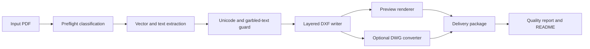

# Architecture

## Scope

This repository is a standalone PDF-to-CAD agent skill framework. It is deliberately separated from any 3D/SolidWorks workflow.

## Flow

## Agent Boundary

The agent should:

- Accept only PDF input for this skill.
- Reject or route 3D formats to a different skill.
- Never invent missing dimensions.
- Preserve Unicode/CJK text where possible.
- Mark question-mark/replacement-glyph text as review-required instead of treating it as final annotation.
- Return the delivery package path and quality status.
- Prefer DXF as the baseline CAD output, with DWG only when a converter is configured and text fidelity is safe enough to recommend.

## Privacy Boundary

The public repository must not contain:

- Customer or private drawings.
- Generated delivery packages.
- Logs from real jobs.
- SSH keys, API keys, private chat messages, bridge settings, or machine-specific paths.
