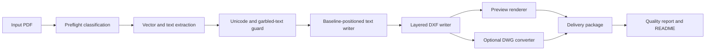

# Architecture

## Scope

This repository is a standalone PDF-to-CAD agent skill framework. It is deliberately separated from any 3D/SolidWorks workflow.

## Flow

## Modular Engine (cadcore)

v2.0 splits the conversion engine into 12 modules under `scripts/cadcore/`:

| Module | Responsibility |
|--------|---------------|
| `constants.py` | Layer specs, regex patterns, DXF/rendering constants |
| `models.py` | Data models: `TextCandidate`, `PageStats`, `ConversionReport` |
| `text_utils.py` | Text cleaning, CJK/garbled detection, deduplication, bbox utilities |
| `fonts.py` | Cross-platform CJK font discovery (macOS/Linux/Windows), text measurement |
| `extraction.py` | Four text extraction strategies (span, word fallback, raw char, annotation) with priority-based dedup |
| `ocr.py` | Tesseract OCR integration, garbled-text repair, page-level OCR |
| `classification.py` | PDF page classification (vector/scanned/mixed/unknown) |
| `dxf_writer.py` | DXF R2018 generation with 8 color-coded layers, coordinate transform, text placement |
| `preview.py` | PNG preview rendering with layer-based coloring, PNG-to-PDF conversion |
| `dwg.py` | Optional DXF-to-DWG conversion via external converter |
| `report.py` | Delivery packaging (README, quality_report.json, zip) |
| `runner.py` | CLI entrypoint and pipeline orchestrator |
| `config.py` | Optional YAML configuration file support (`openclaw-pdf-to-cad.yaml`) |

## Cross-Platform Support

- **macOS:** `/System/Library/Fonts/`, `/Library/Fonts/`
- **Linux:** `/usr/share/fonts/` (Noto CJK, WenQuanYi, Droid), `~/.fonts/`
- **Windows:** `C:\Windows\Fonts\` (ArialUni, MSYH, SimSun, SimHei)
- **Override:** `OPENCLAW_CJK_FONT` and `OPENCLAW_CJK_FONT_DIR` environment variables

## Benchmark Framework

`tests/test_benchmark.py` provides precision evaluation:
- Synthetic ground-truth PDFs with known geometry and text
- Automated scoring: text recall, layer recall, entity/dimension/title ratios
- Garbled-text penalty detection
- Results written as `benchmark_results.json`

## Agent Boundary

The agent should:

- Accept only PDF input for this skill.
- Reject or route 3D formats to a different skill.
- Never invent missing dimensions.
- Preserve Unicode/CJK text where possible.
- Preserve text baseline/origin, font size, rotation, and width factor where possible.
- Mark question-mark/replacement-glyph text as review-required instead of treating it as final annotation.
- Use OCR fallback for scanned/image text only when needed, and report it as OCR-recovered text.
- Return the delivery package path and quality status.
- Prefer DXF as the baseline CAD output, with DWG only when a converter is configured and text fidelity is safe enough to recommend.

## Privacy Boundary

The public repository must not contain:

- Customer or private drawings.
- Generated delivery packages.
- Logs from real jobs.
- SSH keys, API keys, private chat messages, bridge settings, or machine-specific paths.
